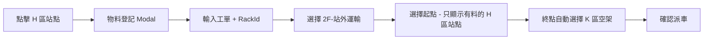

# 2F 樓層分類與 H 區派送流程實作計畫

## 目標

1. **樓層選單分類**：將 2F 分為「站內運輸」和「站外運輸」
2. **H 區派送流程**：與 J 區相同（先建物料、起點過濾、終點自動選 K 區）
3. **K 區 Release 功能**：空板回送到 H 區

---

## 現況分析

### 現行流程
```
1. 選擇樓層 = 2F
2. 選擇派送區域 = H（成型後）
3. 選擇起點站點（如 H1）
4. 終點自動帶出 K 區（4F烘烤前入貨區）空架
5. 輸入工單 → 確認派車
```

### 目標流程
```
1. 點擊地圖上的 H 區站點（如 H1）
2. 彈出物料登記 Modal → 輸入工單和貨架
3. 確認儲存 → 站點狀態改為「料盤」
4. 選擇樓層 = 2F - 站外運輸
5. 選擇派送區域 = H（成型後）
6. 選擇起點 → 只顯示已建立物料的站點
7. 終點自動帶出 K 區空架
8. 確認派車
```

---

## 站點對應表

| 區域 | 系統代號 | 站點範例 | 樓層 | 用途 |
|------|----------|----------|------|------|
| 成型後 | H | H1~Hn | 2F | 成型後暫存區 |
| 烘烤前入貨區 | K | K1~K4 | 4F | 烘烤前入貨區 |

---

## 派送路線總覽

| 路線 | 起點 | 終點 | 功能 |
|------|------|------|------|
| 1 | H (2F 成型後) | K (4F 烘烤前入貨區) | 物料派送 |
| 2 | K (4F 烘烤前入貨區) | H (2F 成型後) | **Release 回送空板** |

---

## 樓層選單設計

```
樓層：
├─ 1F
├─ 2F - 站內運輸    → MT, O, P, Q, R, N, S, T
├─ 2F - 站外運輸    → H
├─ 3F              → J, I
└─ 4F              → K, L
```

---

## H 區派送流程



---

## K 區 Release 功能

### 操作流程

1. 貨物送達 K 區後，人員取走物料
2. 人員在地圖上點擊 K 區站點，彈出操作視窗
3. 點擊「標記為空板」
   - `HaveFlag` 改為 `1`（無料有板）
   - `WorkOrder` 清除為 `NULL`
4. 點擊「Release」
   - 系統自動尋找 **H 區空位**（HaveFlag=0）
   - 找到空位 → 派車回送
   - 無空位 → 彈出提示「2F 成型後 (H區) 沒有可放置的空位」

### UI 設計：K 區站點操作彈窗

**情況 1：料盤（HaveFlag = 3）**
```
┌────────────────────────────────────────────┐
│  📍 K1 站點操作                           │
├────────────────────────────────────────────┤
│  目前狀態：料盤                             │
│  工單：FHT^N01^238090671^...               │
│  貨架：RACK001                              │
├────────────────────────────────────────────┤
│  [📦 標記空板]                  [關閉]      │
└────────────────────────────────────────────┘
```

**情況 2：空板（HaveFlag = 1）**
```
┌────────────────────────────────────────────┐
│  📍 K1 站點操作                           │
├────────────────────────────────────────────┤
│  目前狀態：空板                             │
│  工單：無                                   │
│  貨架：RACK001                              │
├────────────────────────────────────────────┤
│  [🚚 Release 回送]              [關閉]      │
└────────────────────────────────────────────┘
```

### Release 判斷邏輯

```javascript
Release(stationNo) {
    1. 檢查站點狀態是否為 HaveFlag=1（空板）
       → 若不是，提示「請先標記為空板」
    
    2. 尋找 H 區（2F 成型後）可放置位置：
       WHERE Block='H' AND HaveFlag=0 AND BgnToEnd IS NULL AND UseFlag='Y'
       ORDER BY Priority DESC
    
    3. 結果處理：
       → 找到空位：建立派送任務 (K → H)
       → 無空位：彈出提示「2F 成型後 (H區) 沒有可放置的空位」
}
```

---

## 修改項目

### 1. 設定檔 (appsettings.json)

新增樓層分類：

```diff
  "FloorArea": {
    "1F": ["A", "C", "D", "F", "G"],
-   "2F": ["H", "M", "N", "O", "P", "Q", "R", "S", "T", "MT"],
+   "2F - 站內運輸": ["M", "N", "O", "P", "Q", "R", "S", "T", "MT"],
+   "2F - 站外運輸": ["H"],
    "3F": ["J", "I"],
    "4F": ["K", "L"]
  }
```

---

### 2. 前端 (Dispatch.js)

#### 2.1 新增 H 區和 K 區到 validAreas

```diff
- var validAreas = ['M', 'T', 'O', 'P', 'S', 'N', 'J', 'G'];
+ var validAreas = ['M', 'T', 'O', 'P', 'S', 'N', 'J', 'G', 'H', 'K'];
```

#### 2.2 新增 K 區到 releaseAreas

```diff
- var releaseAreas = ['O', 'P', 'S', 'N', 'G'];
+ var releaseAreas = ['O', 'P', 'S', 'N', 'G', 'K'];
```

#### 2.3 修改樓層選擇事件

選擇 "2F - 站外運輸" 時：
- 預設選擇 H 區
- 隱藏工單/RackId 欄位（已在物料登記時輸入）

```javascript
if (selectedFloor === "2F - 站外運輸") {
    if ($("#Area option[value='H']").length > 0) {
        $("#Area").val("H").trigger("change");
    }
    $("#machineScanRow").hide();
    $("#rackIdRow").hide();
    $("#workOrderRow").hide();
}
```

#### 2.4 H 區起點過濾

```javascript
case "H":
    // H 區作為起點：只顯示有料的站點 (HaveFlag = 3)
    $('#BeginStation option').filter(function () {
        var tracname = $(this).val();
        if (!tracname || !tracname.startsWith("H")) return false;
        var station = stationCache[tracname];
        if (!station || station.haveFlag !== "3") return false;
        // 顯示格式: StationNo - WorkOrder
        var workOrder = station.workOrder || "";
        if (workOrder.length > 35) {
            workOrder = workOrder.substring(0, 35) + "...";
        }
        $(this).text(tracname + " - " + workOrder);
        return true;
    }).show();
    break;
```

#### 2.5 H 區終點自動選擇

```javascript
case "H":
    autoSelectEndStation("K", "0", "N");  // H區 → K區（4F烘烤前入貨區）
    break;
```

#### 2.6 H 區工單自動帶入

```javascript
else if (area === "H" && beginStation) {
    var beginStationCache = stationCache[beginStation];
    if (beginStationCache && beginStationCache.workOrder) {
        $("#WorkOrder").val(beginStationCache.workOrder);
        console.log("H 區自動填入工單:", beginStationCache.workOrder);
    }
}
```

#### 2.7 openStationLotModal 支援 H/K 區

- H 區：物料登記（隱藏 V Cut checkbox）
- K 區：標記空板 + Release

```javascript
// H 區不需要 V Cut checkbox
if (stationArea === "T" || stationArea === "J" || stationArea === "H") {
    $("#vcutCheckboxRow").hide();
}
```

#### 2.8 防止重複派工

派工成功後清除站點快取：

```javascript
success: function (response) {
    form[0].reset();
    // 清除站點快取，防止重複派工
    isCacheLoaded = false;
    stationCache = {};
}
```

#### 2.9 終點站驗證

```javascript
// 驗證：終點站必選
if (!endStation || endStation === "" || endStation === "選擇站點") {
    alert('沒有可用的派送終點，請確認目標區域有空位');
    allValid = false;
}
```

---

### 3. 後端 (DispatchController.cs)

#### 3.1 RegisterLot - H 區 RackId 必填

```csharp
// 驗證：J 區和 H 區 RackId 必填
if ((stationArea == "J" || stationArea == "H") && string.IsNullOrEmpty(rackId))
{
    return BadRequest(new { message = "請輸入貨架條碼" });
}
```

#### 3.2 GetAllStations - 排除終點站

```csharp
// 取得已有待處理任務的終點站，避免重複指派
var pendingEndFromONeed = _DBContext.oNeed
    .Where(n => n.AssignFlag == null || n.AssignFlag == "")
    .Select(n => n.EndStation)
    .ToList();

// 合併所有不可選的站點（起點 + 終點）
var allExcludedStations = allPendingBeginStations
    .Concat(allPendingEndStations)
    .Distinct()
    .ToList();
```

#### 3.3 Release - K 區回送到 H 區

```csharp
if (stationArea == "K")
{
    // K 區（4F烘烤前入貨區）→ 回送到 H 區（2F成型後）
    emptySlot = _DBContext.oPort
        .Where(p => p.Block == "H" && 
                    p.HaveFlag == "0" && 
                    (p.BgnToEnd == null || p.BgnToEnd == "") &&
                    p.UseFlag == "Y" &&
                    !pendingEndStations.Contains(p.StationNo))
        .OrderByDescending(p => p.Priority)
        .ThenBy(p => p.Port)
        .FirstOrDefault();

    if (emptySlot == null)
    {
        return BadRequest(new { message = "2F 成型後 (H區) 沒有可放置的空位" });
    }
}
```

---

### 4. 後端 (cPair.cs)

新增 K 區 case：

```csharp
case "K":   // ★★★ 新增：K區（4F烘烤前入貨區）→ H區（2F成型後）：Release 回送空板 ★★★
    WriteLog("05.處理系統配對");
    ProcessoNeedToRequire(dr["ObjStation"].ToString().Substring(0, 1), dr);
    break;
```

---

## 驗證步驟

### H 區物料登記
1. 開啟地圖 → 點擊 H 區空架站點
2. 彈出 Modal → 輸入工單和貨架
3. 確認儲存 → 站點狀態變為「料盤」
4. 驗證 RackId 必填（空白時應顯示錯誤）

### H 區派送
1. 選擇樓層 = "2F - 站外運輸"
2. 區域自動選擇 H
3. 選擇起點 → 只顯示有料站點
4. 終點自動選擇 K 區空架
5. 確認派車
6. 驗證：同一站點不能重複派工

### K 區 Release
1. 點擊 K 區站點（料盤狀態）
2. 標記空板
3. Release 回送
4. 確認建立到 H 區的派送任務
5. 驗證：無空位時顯示正確提示

### 防重複派工驗證
1. 派工成功後再次選擇起點
2. 確認已派工站點不在選項中
3. 確認已指派終點不在選項中

---

## 風險與注意事項

> [!WARNING]
> - 樓層選單格式變更可能影響現有的前端邏輯
> - 需確認後端 FloorArea 讀取邏輯是否支援含空格的 key

> [!IMPORTANT]
> - H 區 RackId 必填（與 J 區相同）
> - K 區 Release 只能回送到 H 區

