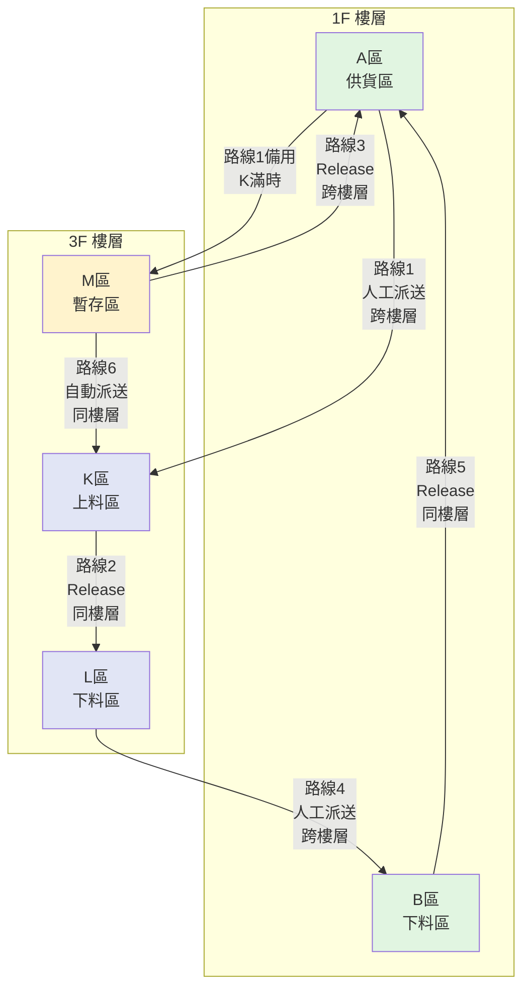

# 工廠1 完整派送邏輯分析

## 系統架構概覽

工廠1的派送系統包含三大核心功能：
1. **物料登記** - 在站點建立物料資訊
2. **派送任務** - 手動派送 + 自動派送
3. **Release 回送** - 空板/空架回送

## 一、區域定義與功能

### 1F 樓層
| 區域 | 名稱 | 站點 | 主要功能 |
|------|------|------|----------|
| **A區** | 供貨區/備貨區 | A1-A5 | 存放待派送物料，作為起點和回送終點 |
| **B區** | 下料區 | B1-B5 | 成品下料暫存，可回送到 A區 |

### 3F 樓層
| 區域 | 名稱 | 站點 | 主要功能 |
|------|------|------|----------|
| **K區** | 左側上料區 | K1-K5 | 機台上料，接收 A區或 M區物料 |
| **L區** | 右側下料區 | L1-L5 | 機台下料，派送到 B區 |
| **M區** | 暫存區 | M1-M5 | 暫存物料，可自動派送到 K區或回送到 A區 |

## 二、六條派送路線詳解

### 路線1: A區 → K區/M區（人工派送，跨樓層）
**RouteId**: `ROUTE_F1_A_TO_K`

**流程**:
```
1. 在 A區建立物料（WorkOrder + RackId）
2. 選擇派送區域 "A"
3. 選擇起點站（如 A1）
4. 系統自動選擇終點：
   - 優先：K區空位（K1-K5）
   - 備用：M區空位（M1-M5）
5. 點擊派車，建立 oNeed 記錄
```

**前端邏輯** (Dispatch.js):
```javascript
case "A":
    // K區優先，K滿則派M區
    autoSelectEndStationWithFallback("K", "M", "0", "N");
    $("#EndStation").prop("disabled", true);
    break;
```

**特點**:
- ✅ 跨樓層派送（1F → 3F）
- ✅ 自動選擇終點（K優先，M備用）
- ✅ WorkOrder 從 oPort 自動讀取

---

### 路線2: K區 → L區（Release，同樓層）
**RouteId**: `ROUTE_F1_K_RELEASE`

**流程**:
```
1. K區機台完成上料，物料變成空板（HaveFlag=1）
2. 點擊站點，選擇「標記空板」
3. 點擊「Release 回送」
4. 系統自動找 L區空位（L1-L5）
5. 建立回送任務到 L區
```

**後端邏輯** (DispatchController.cs):
```csharp
else if (stationArea == "K")
{
    // K區 → L區
    emptySlot = _DBContext.oPort
        .Where(p => p.Block == "L" &&
                    p.HaveFlag == "0" &&
                    (p.BgnToEnd == null || p.BgnToEnd == "") &&
                    p.UseFlag == "Y" &&
                    !pendingEndStations.Contains(p.StationNo))
        .OrderByDescending(p => p.Priority)
        .ThenBy(p => p.Port)
        .FirstOrDefault();
}
```

**特點**:
- ✅ 同樓層回送（3F 內部）
- ✅ 自動選擇 L區空位
- ✅ 使用 Release 功能

---

### 路線3: M區 → A區（Release，跨樓層）
**RouteId**: `ROUTE_F1_M_RELEASE`

**流程**:
```
1. M區物料變成空板（HaveFlag=1）
2. 點擊站點，選擇「標記空板」
3. 點擊「Release 回送」
4. 系統自動找 A區空位（A1-A5）
5. 建立回送任務到 A區
```

**前端邏輯** (Dispatch.js):
```javascript
case "M":
    // M區 → A區（跨樓層）
    autoSelectEndStation("A", "0", "N");
    $("#EndStation").prop("disabled", true);
    break;
```

**後端邏輯** (DispatchController.cs):
```csharp
else if (stationArea == "M")
{
    // M區 → A區
    emptySlot = _DBContext.oPort
        .Where(p => p.Block == "A" &&
                    p.HaveFlag == "0" &&
                    (p.BgnToEnd == null || p.BgnToEnd == "") &&
                    p.UseFlag == "Y" &&
                    !pendingEndStations.Contains(p.StationNo))
        .OrderByDescending(p => p.Priority)
        .ThenBy(p => p.Port)
        .FirstOrDefault();
}
```

**特點**:
- ✅ 跨樓層回送（3F → 1F）
- ✅ 自動選擇 A區空位
- ✅ 使用 Release 功能

---

### 路線4: L區 → B區（人工派送，跨樓層）
**RouteId**: `ROUTE_F1_L_TO_B`

**流程**:
```
1. L區接收機台下料物料（從 K區來）
2. 選擇派送區域 "L"
3. 選擇起點站（如 L1）
4. 系統自動選擇 B區空位（B1-B5）
5. 點擊派車，建立 oNeed 記錄
```

**前端邏輯** (Dispatch.js):
```javascript
case "L":
    // L區 → B區
    filterEndStationOptions("B", "0");
    break;
```

**特點**:
- ✅ 跨樓層派送（3F → 1F）
- ✅ 自動選擇 B區空位
- ✅ WorkOrder 從 oPort 自動讀取

---

### 路線5: B區 → A區（Release，同樓層）
**RouteId**: `ROUTE_F1_B_RELEASE`

**流程**:
```
1. B區成品下料完成，物料變成空板（HaveFlag=1）
2. 點擊站點，選擇「標記空板」
3. 點擊「Release 回送」
4. 系統自動找 A區空位（A1-A5）
5. 建立回送任務到 A區
```

**後端邏輯** (DispatchController.cs):
```csharp
else if (stationArea == "B")
{
    // B區 → A區
    emptySlot = _DBContext.oPort
        .Where(p => p.Block == "A" &&
                    p.HaveFlag == "0" &&
                    (p.BgnToEnd == null || p.BgnToEnd == "") &&
                    p.UseFlag == "Y" &&
                    !pendingEndStations.Contains(p.StationNo))
        .OrderByDescending(p => p.Priority)
        .ThenBy(p => p.Port)
        .FirstOrDefault();
}
```

**特點**:
- ✅ 同樓層回送（1F 內部）
- ✅ 自動選擇 A區空位
- ✅ 使用 Release 功能

---

### 路線6: M區 → K區（自動派送，同樓層）
**RouteId**: `ROUTE_F1_M_TO_K_AUTO`

**流程**:
```
1. M區有物料（HaveFlag=3）
2. K區有空位（HaveFlag=0）
3. AutoDispatchService 背景服務自動檢測（每30秒）
4. 自動建立 oNeed 記錄
5. 依 PutTime 排序（FIFO）
```

**後端邏輯** (AutoDispatchService.cs):
```csharp
// 找 M區 status=3 的物料（依時間優先 FIFO）
var mMaterials = await dbContext.oPort
    .Where(p => p.Block == "M" &&
                p.HaveFlag == "3" &&
                p.UseFlag == "Y" &&
                !allPendingBeginStations.Contains(p.StationNo))
    .OrderBy(p => p.PutTime)  // 時間優先 (FIFO)
    .ToListAsync(stoppingToken);

// 找 K區 status=0 的空位
var kSlots = await dbContext.oPort
    .Where(p => p.Block == "K" &&
                p.HaveFlag == "0" &&
                (p.BgnToEnd == null || p.BgnToEnd == "") &&
                p.UseFlag == "Y" &&
                !allPendingEndStations.Contains(p.StationNo))
    .OrderByDescending(p => p.Priority)
    .ThenBy(p => p.Port)
    .ToListAsync(stoppingToken);

// 依序配對 M區物料 和 K區空位
int dispatchCount = Math.Min(mMaterials.Count, kSlots.Count);
```

**特點**:
- ✅ 全自動派送（無需人工操作）
- ✅ 同樓層派送（3F 內部）
- ✅ FIFO 策略（先進先出）
- ✅ 避免重複派送（檢查 oNeed, oRequire, oMission）

## 三、物料建立邏輯

### 可建立物料的區域

**工廠1 物料登記區**: **A區（1F供貨區）** 和 **L區（3F下料區）**  
**Release 操作區**: B, K, M（空板回送）

### 物料登記流程

**前端** (Dispatch.js):
```javascript
// 物料登記區域判斷
var releaseAreas = ['B', 'O', 'P', 'S', 'N', 'G', 'K', 'I'];
var isReleaseArea = releaseAreas.indexOf(stationArea) !== -1;

if (!isReleaseArea) {
    // A/M/T/J/Q/R 區 - 物料登記操作
    if (stationInfo.haveFlag === "0" || stationInfo.haveFlag === "1") {
        footer.prepend('<button>📋 物料登記</button>');
    }
}
```

**後端** (DispatchController.cs RegisterLot):
```csharp
[HttpPost]
public IActionResult RegisterLot([FromBody] Dictionary<string, string> data)
{
    string stationNo = data["stationNo"];
    string workOrder = data["workOrder"];
    string rackId = data["rackId"];
    
    // 驗證：工單必填（R 區例外）
    var stationArea = stationNo.Substring(0, 1).ToUpper();
    if (string.IsNullOrEmpty(workOrder) && stationArea != "R")
    {
        return BadRequest(new { message = "請輸入工單條碼" });
    }
    
    // 驗證：J/H/I/K/L 區 RackId 必填
    if ((stationArea == "J" || stationArea == "H" || 
         stationArea == "I" || stationArea == "K" || 
         stationArea == "L") && string.IsNullOrEmpty(rackId))
    {
        return BadRequest(new { message = "請輸入貨架條碼" });
    }
    
    // 更新 oPort 表
    _DBContext.oPort
        .Where(p => p.StationNo == stationNo)
        .ExecuteUpdate(setters => setters
            .SetProperty(p => p.HaveFlag, "3")           // 設為料盤
            .SetProperty(p => p.WorkOrder, workOrder)
            .SetProperty(p => p.RackId, rackId)
            .SetProperty(p => p.PutTime, DateTime.Now.ToString("yyyyMMddHHmmssffffff")));
    
    return Ok();
}
```

### 工廠1 物料流動說明

#### A區物料建立與派送
```
1. 在 A區建立物料（WorkOrder + RackId）
2. 派送到 K區（優先）或 M區（K滿時備用）
3. 物料到達 K區：機台上料
4. 物料到達 M區：等待自動派送到 K區（路線6）
```

#### L區物料建立與派送
```
1. K區機台完成上料，Release 空板到 L區
2. 在 L區建立物料（機台下料物料）
3. 派送到 B區（1F下料區）
4. B區完成後，Release 空板回 A區
```

#### M區物料來源（不可直接建立）
```
❌ M區不支援直接建立物料
✅ M區只能接收從 A區派送來的物料（當 K區滿時）
✅ M區物料會自動派送到 K區（路線6，FIFO）
```

## 四、完整物料流程圖



## 五、WorkOrder 資料流

### 問題修正前
```
前端（隱藏欄位）→ 空字串 → 後端 → oNeed.WorkOrder = ""
```

### 問題修正後
```
前端（隱藏欄位）→ 空字串 → 後端檢查 → 從 oPort 讀取 → oNeed.WorkOrder = oPort.WorkOrder
```

**修正程式碼** (DispatchController.cs):
```csharp
// 修正：當 WorkOrder 為空時，從起點站的 oPort 表讀取
if (string.IsNullOrEmpty(workOrder))
{
    workOrder = _DBContext.oPort
        .Where(p => p.StationNo == objStation)
        .FirstOrDefault()?.WorkOrder ?? "";
}
```

## 六、系統互動流程

### 手動派送流程
```
1. 使用者操作 Web UI（Dispatch.js）
   ↓
2. 選擇派送區域和起點站
   ↓
3. 前端自動選擇終點站
   ↓
4. 點擊派車
   ↓
5. 呼叫 DispatchController.InsertoNeed
   ↓
6. 檢查 WorkOrder（如為空則從 oPort 讀取）
   ↓
7. 插入 oNeed 表
   ↓
8. agvFleetManager (cPair.cs) 處理
   ↓
9. 轉換為 oRequire
   ↓
10. 轉換為 oMission
   ↓
11. 派送到 Hikvision RCS
```

### 自動派送流程
```
1. AutoDispatchService 背景服務（每30秒）
   ↓
2. 查詢 M區 status=3 的物料
   ↓
3. 查詢 K區 status=0 的空位
   ↓
4. 檢查是否有待處理任務（避免重複）
   ↓
5. 配對 M區物料和 K區空位（FIFO）
   ↓
6. 直接插入 oNeed 表
   ↓
7. 後續流程同手動派送（步驟 8-11）
```

### Release 回送流程
```
1. 使用者點擊站點（Dispatch.js）
   ↓
2. 選擇「標記空板」（HaveFlag: 3 → 1）
   ↓
3. 選擇「Release 回送」
   ↓
4. 呼叫 DispatchController.Release
   ↓
5. 根據起點區域判斷終點區域
   ↓
6. 查詢終點區域的空位
   ↓
7. 插入 oNeed 表（帶 RackId）
   ↓
8. 後續流程同手動派送（步驟 8-11）
```

## 七、關鍵設計決策

### 1. M區的雙重角色
- **作為終點**: 接收 A區物料（K區滿時）
- **作為起點**: 自動派送到 K區 或 Release 到 A區
- **不可建立物料**: M區只能接收從 A區派送來的物料

**優點**:
- 提供緩衝機制，避免 K區滿時無法派送
- 自動化程度高（M→K 自動派送）
- 簡化物料管理（統一從 A區建立）

### 2. 自動派送的 FIFO 策略
使用 `PutTime` 排序，確保先進先出：
```csharp
.OrderBy(p => p.PutTime)  // 時間優先 (FIFO)
```

**優點**:
- 公平性：先到的物料先派送
- 可追溯性：依時間順序處理
- 避免物料積壓

### 3. WorkOrder 自動讀取機制
當前端未提供 WorkOrder 時，從 oPort 自動讀取：
```csharp
if (string.IsNullOrEmpty(workOrder))
{
    workOrder = _DBContext.oPort
        .Where(p => p.StationNo == objStation)
        .FirstOrDefault()?.WorkOrder ?? "";
}
```

**優點**:
- 簡化前端操作（隱藏欄位）
- 確保資料完整性
- 支援自動化流程

### 4. 重複派送防護機制
檢查三個表避免重複派送：
```csharp
// oNeed: 待處理任務
var pendingFromONeed = _DBContext.oNeed
    .Where(n => n.AssignFlag == null || n.AssignFlag == "")
    .Select(n => n.ObjStation)
    .ToList();

// oRequire: 進行中任務
var pendingFromORequire = _DBContext.oRequire
    .Where(r => r.OkFlag == null || r.OkFlag == "" || r.OkFlag == "R")
    .Select(r => r.BeginStation)
    .ToList();

// oMission: 執行中任務
var pendingFromOMission = _DBContext.oMission
    .Where(m => m.OkFlag == null || m.OkFlag == "" || m.OkFlag == "Y" || m.OkFlag == "R")
    .Select(m => m.BeginStation)
    .ToList();
```

**優點**:
- 避免同一站點重複派送
- 確保任務唯一性
- 提高系統穩定性

## 八、總結

### 工廠1派送系統特點
✅ **6條路線**：涵蓋所有區域間的物料流動  
✅ **3種操作**：物料登記、手動派送、自動派送  
✅ **2個樓層**：1F 和 3F，支援跨樓層派送  
✅ **全自動化**：M→K 自動派送，無需人工干預  
✅ **完整回送**：所有區域都有 Release 回送機制  
✅ **資料完整**：WorkOrder 自動讀取，確保資料正確  

### 與二廠的主要差異
| 項目 | 工廠1 | 二廠 |
|------|-------|------|
| 樓層 | 1F + 3F | 2F + 3F + 4F |
| M區功能 | 暫存區（自動派送到K區） | 雷雕區（派送到O/P/T區） |
| 自動派送 | M→K（路線6） | 無 |
| 區域數量 | 5個（A/B/K/L/M） | 更多區域 |
| 路線數量 | 6條 | 更多路線 |
