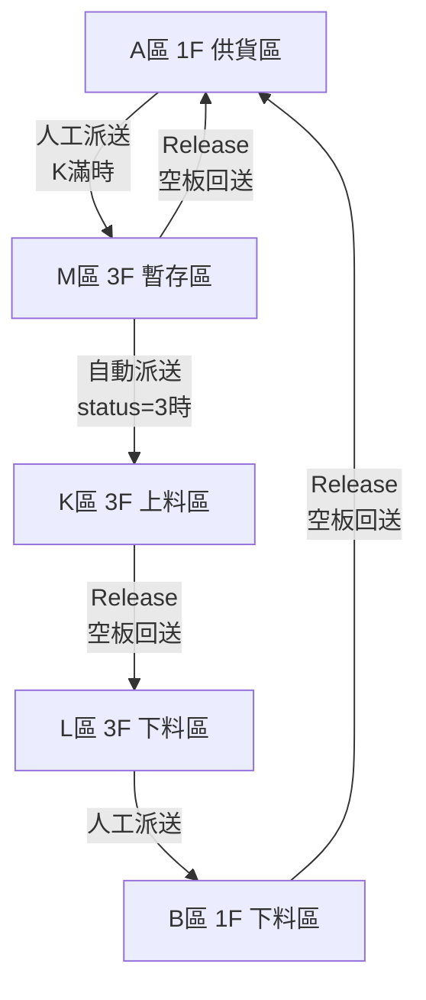

# 工廠1 M區邏輯分析

## M區定位與功能

### 基本資訊
- **位置**: 3F 暫存區 (Buffer area)
- **站點數量**: 5個 (M1-M5)
- **主要功能**: 暫存待派送物料，或自動派送到 K 區

### 區域設定 (appsettings.json)
```json
"3F 暫存區(Buffer area)": "M"
```

### 樓層配置 (FloorSettings)
```json
"FHT1-3F": {
  "DisplayName": "工廠1 - 3F",
  "Areas": ["K", "L", "M"]
}
```

## M區相關路線

### 路線1: A區 → K區/M區 (人工派送，跨樓層)
- **RouteId**: `ROUTE_F1_A_TO_K`
- **起點**: A區 (1F 供貨區)
- **終點**: K區優先，K滿則派M區
- **類型**: CROSS_FLOOR (1F → 3F)
- **模式**: DISPATCH (人工派送)
- **說明**: M區作為 K區的備用終點

### 路線3: M區 → A區 (Release，跨樓層)
- **RouteId**: `ROUTE_F1_M_RELEASE`
- **起點**: M區 (3F 暫存區)
- **終點**: A區 (1F 供貨區)
- **類型**: CROSS_FLOOR (3F → 1F)
- **模式**: RELEASE (空板回送)
- **說明**: M區空板回送到 A區

### 路線6: M區 → K區 (自動派送，同樓層)
- **RouteId**: `ROUTE_F1_M_TO_K_AUTO`
- **起點**: M區 (3F 暫存區)
- **終點**: K區 (3F 左側上料區)
- **類型**: INTERNAL (3F 內部)
- **模式**: AUTO (自動派送)
- **觸發條件**: M區 status=3 且 K區 status=0

## 程式碼實作

### 1. 自動派送服務 (AutoDispatchService.cs)

**功能**: M區 → K區自動派送

**邏輯**:
```csharp
// 找 M區 status=3 的物料（依時間優先 FIFO）
var mMaterials = await dbContext.oPort
    .Where(p => p.Block == "M" &&
                p.HaveFlag == "3" &&
                p.UseFlag == "Y" &&
                !allPendingBeginStations.Contains(p.StationNo))
    .OrderBy(p => p.PutTime)  // 時間優先 (FIFO)
    .ToListAsync(stoppingToken);

// 找 K區 status=0 的空位
var kSlots = await dbContext.oPort
    .Where(p => p.Block == "K" &&
                p.HaveFlag == "0" &&
                (p.BgnToEnd == null || p.BgnToEnd == "") &&
                p.UseFlag == "Y" &&
                !allPendingEndStations.Contains(p.StationNo))
    .OrderByDescending(p => p.Priority)
    .ThenBy(p => p.Port)
    .ToListAsync(stoppingToken);

// 依序配對 M區物料 和 K區空位
int dispatchCount = Math.Min(mMaterials.Count, kSlots.Count);
```

**特點**:
- ✅ 正確從 `oPort` 讀取 `WorkOrder`
- ✅ 使用 FIFO (First In First Out) 策略
- ✅ 避免重複派送（檢查 oNeed, oRequire, oMission）

### 2. 手動派送邏輯 (Dispatch.js)

**A區 → M區** (作為 K區備用):
```javascript
case "A":
    // 工廠1 路線1: A區 → K區（優先）/ M區（備用）
    autoSelectEndStationWithFallback("K", "M", "0", "N");
    $("#EndStation").prop("disabled", true);
    break;
```

**M區 → A區** (Release 回送):
```javascript
case "M":
    // 工廠1 路線3: M區 → A區（跨樓層）
    autoSelectEndStation("A", "0", "N");
    $("#EndStation").prop("disabled", true);
    break;
```

### 3. Release 功能 (DispatchController.cs)

**M區空板回送邏輯**:
```csharp
else if (stationArea == "M")
{
    // 工廠1 路線3: M區（3F暫存區）→ A區（1F備貨區）跨樓層
    emptySlot = _DBContext.oPort
        .Where(p => p.Block == "A" &&
                    p.HaveFlag == "0" &&
                    (p.BgnToEnd == null || p.BgnToEnd == "") &&
                    p.UseFlag == "Y" &&
                    !pendingEndStations.Contains(p.StationNo))
        .OrderByDescending(p => p.Priority)
        .ThenBy(p => p.Port)
        .FirstOrDefault();

    if (emptySlot == null)
    {
        return BadRequest(new { message = "A區（1F備貨區）沒有可放置的空位" });
    }
}
```

## M區完整流程圖



## 總結

### M區的三種角色

1. **作為終點** (路線1)
   - 接收從 A區來的物料（當 K區滿時）
   - 需要先建立物料（WorkOrder + RackId）

2. **作為起點 - 自動派送** (路線6)
   - 自動派送到 K區
   - 條件: M區 status=3 且 K區 status=0
   - 使用 AutoDispatchService 背景服務

3. **作為起點 - Release** (路線3)
   - 空板回送到 A區
   - 跨樓層 (3F → 1F)

### 目前狀態
- ✅ M區已完整配置為工廠1專用
- ✅ 所有路線定義正確
- ✅ 自動派送服務運作正常
- ✅ Release 功能已實作
- ✅ WorkOrder 讀取邏輯已修正

### 與二廠的差異
工廠1的 M區是**全新設計**，與二廠的 M區（雷雕區）完全不同：
- 二廠 M區: 雷雕區，可派送到 O/P/T 區
- 工廠1 M區: 暫存區，作為 K區的緩衝，可自動派送到 K區
