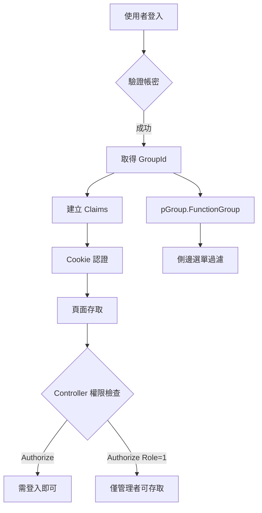

# 人員權限管理流程說明

## 資料表結構

| 資料表 | 說明 |
|--------|------|
| `pUser` | 使用者基本資料（帳號、密碼、群組 ID） |
| `pGroup` | 群組定義（群組名稱、登出時間、功能權限） |
| `pFunction` | 系統功能定義（選單項目、URL、圖示） |

---

## 權限運作流程



---

## 權限層級

| GroupId | 群組名稱 | 說明 | 登出時間 |
|---------|----------|------|----------|
| 1 | 管理者 (Administrator) | 完整系統權限 | 24 小時 |
| 2 | 備料人員 (Enginer) | 可使用特定區域 A | 12 小時 |
| 3 | 生產人員 (Operate) | 生產相關功能 | 6 小時 |
| 4 | 下料人員 | 未設定 | 6 小時 |
| 5 | (推測) F 區權限 | - | - |
| 6 | (推測) C/D 區權限 | - | - |
| 7 | 重新登入權限 | 可執行重新登入驗證 | - |

---

## 權限控制機制

### 1. Controller 層級控制

使用 ASP.NET Core 的 `[Authorize]` 屬性：

```csharp
// 只需登入即可
[Authorize]
public IActionResult Index() { ... }

// 僅 GroupId = "1" 的管理者可存取
[Authorize(Roles = "1")]
public class UserController : Controller { ... }
```

**受保護的 Controller（僅管理者可存取）**：
- `UserController` - 使用者管理
- `GroupController` - 群組管理  
- `ShiftController` - 班次管理
- `ProgramGroupController` - 程式群組管理
- `PortController` - 站點管理
- `MainFunController` - 主功能管理

### 2. 派送區域篩選

檔案：`DispatchController.cs`

```csharp
switch (groupId)
{
    case "2":
        filterAreas = areas.Where(item => item.Value == "A");  // 備料人員 → A區
        break;
    case "6":
        filterAreas = areas.Where(item => item.Value == "C" || item.Value == "D");
        break;
    case "5":
        filterAreas = areas.Where(item => item.Value == "F");
        break;
    // 其他群組可看到所有區域
}
```

### 3. 重新登入權限驗證

檔案：`DispatchController.cs`

```csharp
// 特定操作需要重新驗證身份
var result = _DBContext.pUser
    .Where(u => u.UserId == userId && u.Password == password)
    .FirstOrDefault()?.GroupId?.ToString() ?? "";
    
if (result == "1" || result == "7")  // 只有 GroupId 1 或 7 可執行
{
    return Ok();
}
```

### 4. 選單功能權限

- `pGroup.FunctionGroup` 存放該群組可存取的功能編號（逗號分隔）
- 例如：`"102,201,301,302"` 表示可存取功能編號 102、201、301、302
- 透過 `ProgramGroupController.ShowpFunction()` 管理權限配置

---

## 登入認證流程

檔案：`AccountController.cs`

1. 查詢 `pUser` 表驗證帳密
2. Join `pGroup` 取得群組資訊
3. 建立 Claims：
   - `ClaimTypes.Name` = 使用者名稱
   - `ClaimTypes.NameIdentifier` = 使用者 ID
   - `ClaimTypes.Role` = GroupId
4. 設定 Cookie 過期時間 = `pGroup.LogoutTime`（分鐘）

```csharp
var claims = new List<Claim>
{
    new Claim(ClaimTypes.Name, user.UserName),
    new Claim(ClaimTypes.NameIdentifier, user.UserId),
    new Claim(ClaimTypes.Role, user.GroupId)
};

var authProperties = new AuthenticationProperties
{
    ExpiresUtc = DateTime.UtcNow.AddMinutes(Convert.ToDouble(user.LogoutTime))
};

await HttpContext.SignInAsync(
    CookieAuthenticationDefaults.AuthenticationScheme, 
    new ClaimsPrincipal(claimsIdentity), 
    authProperties);
```

---

## 相關檔案位置

| 檔案 | 路徑 | 說明 |
|------|------|------|
| AccountController.cs | `WebGui/SCP/Controllers/` | 登入/登出邏輯 |
| DispatchController.cs | `WebGui/SCP/Controllers/` | 派送區域權限過濾 |
| ProgramGroupController.cs | `WebGui/SCP/Controllers/` | 群組功能權限管理 |
| UserController.cs | `WebGui/SCP/Controllers/` | 使用者管理 |
| pUser.cs | `WebGui/SCP/Models/` | 使用者 Model |
| pGroup.cs | `WebGui/SCP/Models/` | 群組 Model |
| pFunction.cs | `WebGui/SCP/Models/` | 功能 Model |
| _Layout.cshtml | `WebGui/SCP/Views/Shared/` | 側邊選單渲染 |

---

## 注意事項

| 項目 | 說明 |
|------|------|
| ⚠️ 密碼明碼儲存 | 目前密碼未加密，有安全隱患 |
| ⚠️ 硬編碼區域權限 | 區域篩選 switch-case 需手動維護 |
| ✅ 簡單易懂 | 基於群組的權限，易於維護 |
| ✅ 分層控制 | Controller 層 + 業務邏輯層雙重控制 |

---

## 人員派送區域權限對照表

| GroupId | 群組名稱 | 可派送區域 | 區域說明 |
|---------|----------|------------|----------|
| **1** | 管理者 | **全部區域** | 所有 1F-4F 區域 |
| **2** | 備料人員 | **A** | 1F 備料區 |
| **3** | 生產人員 | **全部區域** | （未做限制） |
| **4** | 下料人員 | **全部區域** | （未做限制） |
| **5** | - | **F** | 1F 下料區 |
| **6** | - | **C, D** | 1F 待料上料區、待料下料區 |
| **7** | - | **全部區域** | （未做限制） |

> ⚠️ **注意**：目前 GroupId 5、6、7 在資料庫 `pGroup` 表中沒有對應的資料，但程式碼中有做派送區域限制。

---

## 所有可用區域一覽

| 樓層 | 區域代碼 | 區域名稱 |
|------|----------|----------|
| **1F** | A | 備料區 |
| **1F** | C | 待料上料區 |
| **1F** | D | 待料下料區 |
| **1F** | F | 下料區 |
| **1F** | G | 電梯暫存區 |
| **2F** | H | 成型後 |
| **2F** | M | 雷雕備貨區 |
| **2F** | N | 廢料回收區 |
| **2F** | O | 左機台上料區 |
| **2F** | P | 右機台上料區 |
| **2F** | Q | 出料區 |
| **2F** | R | 廢料區 |
| **2F** | S | 清洗區 |
| **2F** | T | V cut區 |
| **2F** | MT | 雷雕區 & V cut備貨區 |
| **3F** | J | 插針室 |
| **3F** | I | 品檢區 |
| **4F** | K | 烘烤前入貨區 |
| **4F** | L | 烘烤後出貨區 |
