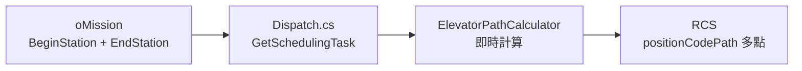

# 跨樓層電梯任務實作計畫（即時計算方案）

## 問題描述

AGV 跨樓層搬運需要搭乘電梯：
- **客梯**：1F-3F | **客貨梯**：3F-4F

跨樓層任務需從「起點→終點」改為「多點路徑」。

### 單電梯路徑範例（客梯 1F-3F）

| 方向 | 路徑 |
|------|------|
| 3F→1F（下行） | J1 → W1(3F等待) → W2(3F電梯內) → U2(1F電梯內) → G1 |
| 1F→3F（上行） | G1 → U1(1F等待) → U2(1F電梯內) → W2(3F電梯內) → J1 |

### 雙電梯路徑範例（2F↔4F 需換乘）

| 方向 | 路徑 |
|------|------|
| 2F→4F（上行） | H1 → V1 → V2 → W2 → X1 → X2 → Y2 → K1 |
| 4F→2F（下行） | K1 → Y1 → Y2 → X2 → W1 → W2 → V2 → H1 |

---

## 需要確認

> **請確認電梯站點名稱**：
> 
> | 電梯 | 樓層 | 等待點 | 電梯內點 |
> |-----|------|--------|---------|
> | 客梯 | 1F | U1 | U2 |
> | 客梯 | 2F | V1 | V2 |
> | 客梯 | 3F | W1 | W2 |
> | 客貨梯 | 3F | X1 | X2 |
> | 客貨梯 | 4F | Y1 | Y2 |

> **備註**：此方案**不修改資料庫結構**，路徑在任務執行時即時計算。

---

## 系統架構



---

## 改動範圍

**只修改 HikAGVWebAPI 專案**：

### 電梯配置

#### [MODIFY] App.config

新增電梯配置：

```xml
<appSettings>
  <!-- 電梯站點配置 -->
  <add key="Elevator_客梯_Floors" value="1F,2F,3F"/>
  <add key="Elevator_客梯_WaitPoints" value="1F:U1,2F:V1,3F:W1"/>
  <add key="Elevator_客梯_InsidePoints" value="1F:U2,2F:V2,3F:W2"/>
  <add key="Elevator_客貨梯_Floors" value="3F,4F"/>
  <add key="Elevator_客貨梯_WaitPoints" value="3F:X1,4F:Y1"/>
  <add key="Elevator_客貨梯_InsidePoints" value="3F:X2,4F:Y2"/>
  
  <!-- 站點樓層對照 -->
  <add key="StationFloorMapping" value="A:1F,C:1F,D:1F,F:1F,G:1F,H:2F,M:2F,N:2F,O:2F,P:2F,Q:2F,R:2F,S:2F,T:2F,I:3F,J:3F,K:4F,L:4F"/>
</appSettings>
```

---

### 路徑計算引擎

#### [NEW] ElevatorPathCalculator.cs

```csharp
public class ElevatorPathCalculator
{
    /// <summary>
    /// 計算完整路徑（包含電梯中繼點）
    /// </summary>
    public List<string> CalculatePath(string beginStation, string endStation)
    {
        var beginFloor = GetFloor(beginStation);
        var endFloor = GetFloor(endStation);
        
        if (beginFloor == endFloor)
            return new List<string> { beginStation, endStation };
        
        // 計算需要的電梯與中繼點...
    }
    
    /// <summary>
    /// 取得站點所屬樓層（根據首字母）
    /// </summary>
    public string GetFloor(string station) 
        => StationFloorMapping[station[0].ToString()];
}
```

**路徑計算邏輯**：

| 起終樓層 | 電梯選擇 | 路徑模式 |
|---------|---------|---------|
| 1F ↔ 2F | 客梯 | 起點 → 等待 → 電梯內起 → 電梯內終 → 終點 |
| 1F ↔ 3F | 客梯 | 同上 |
| 2F ↔ 3F | 客梯 | 同上 |
| 3F ↔ 4F | 客貨梯 | 同上 |
| 1F/2F ↔ 4F | 客梯+客貨梯 | 起點 → 客梯中繼 → 3F換乘 → 客貨梯中繼 → 終點 |

---

### 任務執行修改

#### [MODIFY] Dispatch.cs

修改 `GetSchedulingTask()` 方法：

```diff
 private SchedulingTaskAck GetSchedulingTask(string TaskType, oMissionModel oMission)
 {
-    string PositionCode = $@"{oMission.BeginStation},00;{oMission.EndStation},00";
+    // 即時計算電梯路徑
+    var pathCalculator = new ElevatorPathCalculator();
+    var fullPath = pathCalculator.CalculatePath(oMission.BeginStation, oMission.EndStation);
+    string PositionCode = string.Join(";", fullPath.Select(p => $"{p},00"));
     
     SchedulingTask AGVStatus = new SchedulingTask()
     {
         reqCode = DateTime.Now.ToString("yyyyMMddHHmmssffffff"),
         podCode = rackId,
         taskTyp = TaskType,
         positionCodePath = PositionCode.Split(';').Select(x => x.Split(','))
                                          .Select(x => new CodePath { positionCode = x[0], type = x[1] }).ToList(),
     };
     // ...
 }
```

---

## 驗證計畫

### 單元測試

| 測試案例 | 起點 | 終點 | 預期路徑 |
|---------|------|------|---------|
| 同樓層 | M1 | O1 | M1, O1 |
| 客梯下行 3F→1F | J1 | G1 | J1, W1, W2, U2, G1 |
| 客梯上行 1F→3F | G1 | J1 | G1, U1, U2, W2, J1 |
| 雙電梯上行 2F→4F | H1 | K1 | H1, V1, V2, W2, X1, X2, Y2, K1 |
| 雙電梯下行 4F→2F | K1 | H1 | K1, Y1, Y2, X2, W1, W2, V2, H1 |

### 手動測試

1. **同樓層任務**：2F M1 → O1，確認 AGV 正常執行
2. **單電梯任務**：3F J1 → 1F G1，觀察 AGV 路徑
3. **雙電梯任務**：2F H1 → 4F K1，觀察 AGV 路徑

---

## 實作順序

1. 新增 `ElevatorPathCalculator.cs`
2. 修改 `App.config` 電梯配置
3. 修改 `Dispatch.cs` 的 `GetSchedulingTask()`
4. 本地測試路徑計算邏輯
5. 整合測試（需 RCS 連線）
