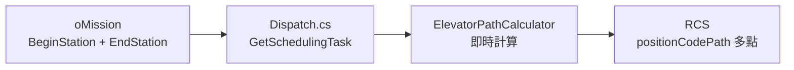

# 跨樓層電梯任務實作計畫（即時計算方案）

## 問題描述

AGV 跨樓層搬運需要搭乘電梯：
- **客梯**：1F-3F | **客貨梯**：3F-4F

跨樓層任務需從「起點→終點」改為「多點路徑」。

### 單電梯路徑範例（客梯 1F-3F）

| 方向 | 路徑 |
|------|------|
| 3F→1F（下行） | J1 → W1(3F等待) → W2(3F電梯內) → U2(1F電梯內) → G1 |
| 1F→3F（上行） | G1 → U1(1F等待) → U2(1F電梯內) → W2(3F電梯內) → J1 |

### 雙電梯路徑範例（2F↔4F 需換乘）

| 方向 | 路徑 |
|------|------|
| 2F→4F（上行） | H1 → V1 → V2 → W2 → X1 → X2 → Y2 → K1 |
| 4F→2F（下行） | K1 → Y1 → Y2 → X2 → W1 → W2 → V2 → H1 |

---

## 需要確認

> **請確認電梯站點名稱**：
> 
> | 電梯 | 樓層 | 等待點 | 電梯內點 |
> |-----|------|--------|---------|
> | 客梯 | 1F | U1 | U2 |
> | 客梯 | 2F | V1 | V2 |
> | 客梯 | 3F | W1 | W2 |
> | 客貨梯 | 3F | X1 | X2 |
> | 客貨梯 | 4F | Y1 | Y2 |

> **備註**：此方案**不修改資料庫結構**，路徑在任務執行時即時計算。

---

## 系統架構



---

## 改動範圍

**只修改 HikAGVWebAPI 專案**：

### 配置模型

#### [NEW] ElevatorPathCalculator.cs

位置：`ACC/HikAGVWebAPI/HikAGVWebAPI/App_Start/ElevatorPathCalculator.cs`

```csharp
public class ElevatorPathCalculator
{
    private readonly ElevatorSettings _settings;
    
    // 電梯資訊
    private Dictionary<string, string> CustomerWaitPoints;     // 客梯等待點
    private Dictionary<string, string> CustomerInsidePoints;   // 客梯電梯內點
    private Dictionary<string, string> FreightWaitPoints;      // 客貨梯等待點
    private Dictionary<string, string> FreightInsidePoints;    // 客貨梯電梯內點
    private Dictionary<string, string> StationFloorMapping;    // 站點樓層對照
    
    public ElevatorPathCalculator(ElevatorSettings settings)
    {
        _settings = settings;
        ParseSettings();
    }
    
    /// <summary>
    /// 計算完整路徑（包含電梯中繼點）
    /// </summary>
    public List<string> CalculatePath(string beginStation, string endStation)
    {
        var path = new List<string> { beginStation };
        var beginFloor = GetFloor(beginStation);
        var endFloor = GetFloor(endStation);
        
        if (beginFloor == endFloor)
        {
            path.Add(endStation);
            return path;
        }
        
        // 判斷使用哪個電梯
        bool needCustomerElevator = NeedCustomerElevator(beginFloor, endFloor);
        bool needFreightElevator = NeedFreightElevator(beginFloor, endFloor);
        bool isGoingUp = CompareFloor(beginFloor, endFloor) < 0;
        
        if (needCustomerElevator && needFreightElevator)
        {
            // 雙電梯換乘（經過 3F）
            AddElevatorPath(path, beginFloor, "3F", isGoingUp, isCustomer: true);
            AddElevatorPath(path, "3F", endFloor, isGoingUp, isCustomer: false);
        }
        else if (needCustomerElevator)
        {
            AddElevatorPath(path, beginFloor, endFloor, isGoingUp, isCustomer: true);
        }
        else if (needFreightElevator)
        {
            AddElevatorPath(path, beginFloor, endFloor, isGoingUp, isCustomer: false);
        }
        
        path.Add(endStation);
        return path;
    }
    
    /// <summary>
    /// 取得站點所屬樓層（根據首字母）
    /// </summary>
    public string GetFloor(string station) 
        => StationFloorMapping[station[0].ToString().ToUpper()];
}
```

**路徑計算邏輯**：

| 起終樓層 | 電梯選擇 | 路徑模式 |
|---------|---------|---------| 
| 1F ↔ 2F | 客梯 | 起點 → 等待 → 電梯內起 → 電梯內終 → 終點 |
| 1F ↔ 3F | 客梯 | 同上 |
| 2F ↔ 3F | 客梯 | 同上 |
| 3F ↔ 4F | 客貨梯 | 同上 |
| 1F/2F ↔ 4F | 客梯+客貨梯 | 起點 → 客梯中繼 → 3F換乘 → 客貨梯中繼 → 終點 |

---

#### [MODIFY] ConfigModel.cs

位置：`ACC/HikAGVWebAPI/HikAGVWebAPI/Models/ConfigModel.cs`

新增電梯配置類別：

```csharp
#region Elevator Config
public class SectionElevator : ConfigurationSection
{
    [ConfigurationProperty(nameof(ElevatorSettings))]
    public ElevatorSettings ElevatorSettings
    {
        get => (ElevatorSettings)this[nameof(ElevatorSettings)];
        set => this[nameof(ElevatorSettings)] = value;
    }
}

public class ElevatorSettings : ConfigurationElement
{
    [ConfigurationProperty(nameof(CustomerElevatorFloors), DefaultValue = "1F,2F,3F")]
    public string CustomerElevatorFloors { get => (string)this[nameof(CustomerElevatorFloors)]; }

    [ConfigurationProperty(nameof(CustomerElevatorWaitPoints), DefaultValue = "1F:U1,2F:V1,3F:W1")]
    public string CustomerElevatorWaitPoints { get => (string)this[nameof(CustomerElevatorWaitPoints)]; }

    [ConfigurationProperty(nameof(CustomerElevatorInsidePoints), DefaultValue = "1F:U2,2F:V2,3F:W2")]
    public string CustomerElevatorInsidePoints { get => (string)this[nameof(CustomerElevatorInsidePoints)]; }

    [ConfigurationProperty(nameof(FreightElevatorFloors), DefaultValue = "3F,4F")]
    public string FreightElevatorFloors { get => (string)this[nameof(FreightElevatorFloors)]; }

    [ConfigurationProperty(nameof(FreightElevatorWaitPoints), DefaultValue = "3F:X1,4F:Y1")]
    public string FreightElevatorWaitPoints { get => (string)this[nameof(FreightElevatorWaitPoints)]; }

    [ConfigurationProperty(nameof(FreightElevatorInsidePoints), DefaultValue = "3F:X2,4F:Y2")]
    public string FreightElevatorInsidePoints { get => (string)this[nameof(FreightElevatorInsidePoints)]; }

    [ConfigurationProperty(nameof(StationFloorMapping), DefaultValue = "A:1F,C:1F,D:1F,F:1F,G:1F,H:2F,M:2F,N:2F,O:2F,P:2F,Q:2F,R:2F,S:2F,T:2F,I:3F,J:3F,K:4F,L:4F")]
    public string StationFloorMapping { get => (string)this[nameof(StationFloorMapping)]; }
}
#endregion Elevator Config
```

---

### 電梯配置

#### [MODIFY] FHtSetting.config

位置：`ACC/HikAGVWebAPI/HikAGVWebAPI/Config/FHtSetting.config`

新增電梯配置區塊：

```xml
<?xml version="1.0" encoding="utf-8" ?>
<configuration>
  <configSections>
    <section name="SectionDB" type="HikAGVWebAPI.SectionDB, HikAGVWebAPI"/>
    <section name="SectionLog" type="HikAGVWebAPI.SectionLog, HikAGVWebAPI"/>
    <section name="SectionFHt" type="HikAGVWebAPI.SectionFHt, HikAGVWebAPI"/>
    <section name="SectionElevator" type="HikAGVWebAPI.SectionElevator, HikAGVWebAPI"/>
  </configSections>

  <!-- 既有配置... -->

  <SectionElevator>
    <ElevatorSettings 
      CustomerElevatorFloors="1F,2F,3F"
      CustomerElevatorWaitPoints="1F:U1,2F:V1,3F:W1"
      CustomerElevatorInsidePoints="1F:U2,2F:V2,3F:W2"
      FreightElevatorFloors="3F,4F"
      FreightElevatorWaitPoints="3F:X1,4F:Y1"
      FreightElevatorInsidePoints="3F:X2,4F:Y2"
      StationFloorMapping="A:1F,C:1F,D:1F,F:1F,G:1F,H:2F,M:2F,N:2F,O:2F,P:2F,Q:2F,R:2F,S:2F,T:2F,I:3F,J:3F,K:4F,L:4F" />
  </SectionElevator>
</configuration>
```

---

### 任務執行修改

#### [MODIFY] Dispatch.cs

位置：`ACC/HikAGVWebAPI/HikAGVWebAPI/App_Start/Dispatch.cs`

**1. 新增成員變數與初始化**（約 L20）：

```csharp
private ElevatorSettings ElevatorSettings = new ElevatorSettings();
```

**2. 修改 ReadDBConfig() 讀取電梯配置**（約 L97 後新增）：

```csharp
// 載入電梯配置
SectionElevator SectionElevator = config.GetSection(nameof(SectionElevator)) as SectionElevator;
ElevatorSettings = SectionElevator?.ElevatorSettings;
```

**3. 修改 GetSchedulingTask() 方法**（L460-485）：

```diff
 private SchedulingTaskAck GetSchedulingTask(string TaskType, oMissionModel oMission)
 {
     SchedulingTaskAck ReturnAck = new SchedulingTaskAck();

     try
     {
         var rackId = string.IsNullOrEmpty(oMission.RackId) ? "-1" : oMission.RackId;
-        string PositionCode = $@"{oMission.BeginStation},00;{oMission.EndStation},00";
+        // 計算電梯路徑
+        var pathCalculator = new ElevatorPathCalculator(ElevatorSettings);
+        var fullPath = pathCalculator.CalculatePath(oMission.BeginStation, oMission.EndStation);
+        string PositionCode = string.Join(";", fullPath.Select(p => $"{p},00"));
+        mLog.TraceOut($"Calculated Path: {PositionCode}", Log.LogType.NONE);
         
         SchedulingTask AGVStatus = new SchedulingTask()
         {
             reqCode = DateTime.Now.ToString("yyyyMMddHHmmssffffff"),
             podCode = rackId,
             taskTyp = TaskType,
             positionCodePath = PositionCode.Split(';').Select(x => x.Split(','))
                                              .Select(x => new CodePath { positionCode = x[0], type = x[1] }).ToList(),
         };

         ReturnAck = hikAGV.SchedulingTask(AGVStatus);
     }
     catch (Exception ex)
     {
         mLog.TraceOut($"Get Scheduling Task Exception! [Exception] : {ex.Message}", Log.LogType.NONE);
     }

     return ReturnAck;
 }
```

---

## 驗證計畫

### 測試案例

| 測試案例 | 起點 | 終點 | 預期路徑 |
|---------|------|------|---------|
| 同樓層 | M1 | O1 | `M1,00;O1,00` |
| 客梯下行 3F→1F | J1 | G1 | `J1,00;W1,00;W2,00;U2,00;G1,00` |
| 客梯上行 1F→3F | G1 | J1 | `G1,00;U1,00;U2,00;W2,00;J1,00` |
| 雙電梯上行 2F→4F | H1 | K1 | `H1,00;V1,00;V2,00;W2,00;X1,00;X2,00;Y2,00;K1,00` |
| 雙電梯下行 4F→2F | K1 | H1 | `K1,00;Y1,00;Y2,00;X2,00;W1,00;W2,00;V2,00;H1,00` |

### 手動測試

1. **同樓層任務**：2F M1 → O1，確認 AGV 正常執行
2. **單電梯任務**：3F J1 → 1F G1，觀察 AGV 路徑
3. **雙電梯任務**：2F H1 → 4F K1，觀察 AGV 路徑

### 驗證方式

1. **編譯測試**：確認專案可正常編譯
2. **Log 驗證**：觀察 AGVDispatch Log 中 `Calculated Path:` 記錄

---

## 實作順序

1. [x] 修改 `ConfigModel.cs` 新增 `SectionElevator` 與 `ElevatorSettings`
2. [ ] 新增 `ElevatorPathCalculator.cs`
3. [ ] 修改 `FHtSetting.config` 新增電梯配置
4. [ ] 修改 `Dispatch.cs` 的 `ReadDBConfig()` 與 `GetSchedulingTask()`
5. [ ] 本地編譯測試
6. [ ] 整合測試（需 RCS 連線）
